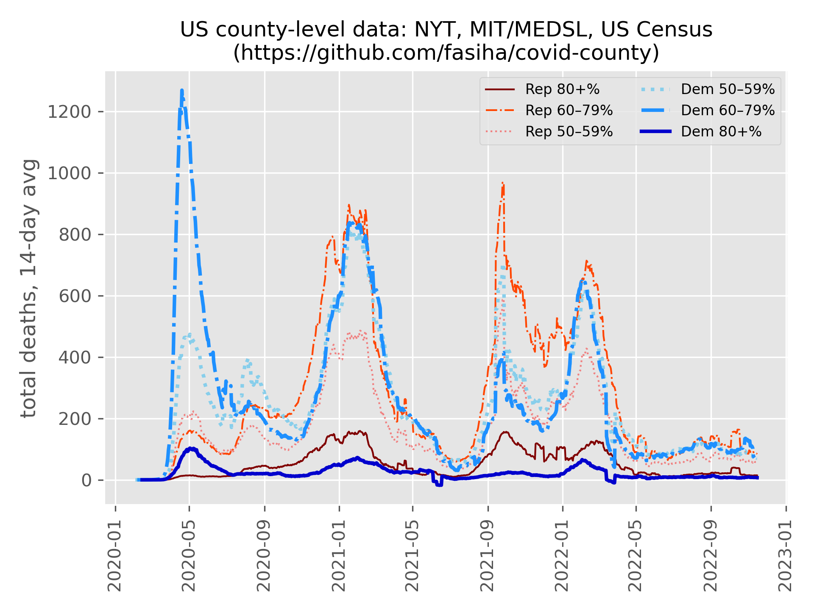

# Covid County
## Executive summary



## Setup
Install [miniconda](https://docs.conda.io/en/latest/miniconda.html), then in the command line, run
```console
conda create -n covid-county
conda activate covid-county
conda install pandas ipython matplotlib
```
(Let me know if you want pure-Python no-Conda instructions via `venv`.)

## 2020 US presidential election
Download `countypres_2000-2020.csv` from https://dataverse.harvard.edu/dataset.xhtml?persistentId=doi:10.7910/DVN/VOQCHQ

2020 data is missing counts for District of Columbia (FIPS 11001)? Party split taken from 2016 election.

## Covid
Install [Git](https://git-scm.com) and run this in this directory: `git clone --depth 1 https://github.com/nytimes/covid-19-data.git` (it might take a while)

Note five boroughs of NYC are combined into a single "county". This is taken into account by merging the 2020 Presidential votes from all five boroughs into a single county (since we can't split the Covid deaths into individual boroughs, this is the best we can do).

## Run
```
python main.py
```

## More results
| party bin | total Covid-19 deaths |
|---|---|
| Dem <-20% |  38284| 
| Dem <-40% | 211416| 
| Dem <-50% | 123587| 
| Dem <+60% | 196084| 
| Dem <+80% | 210070| 
| Dem >+80% |  18331| 
| unknown   |   5243| 

- Dem: 424485
- Rep: 373287
