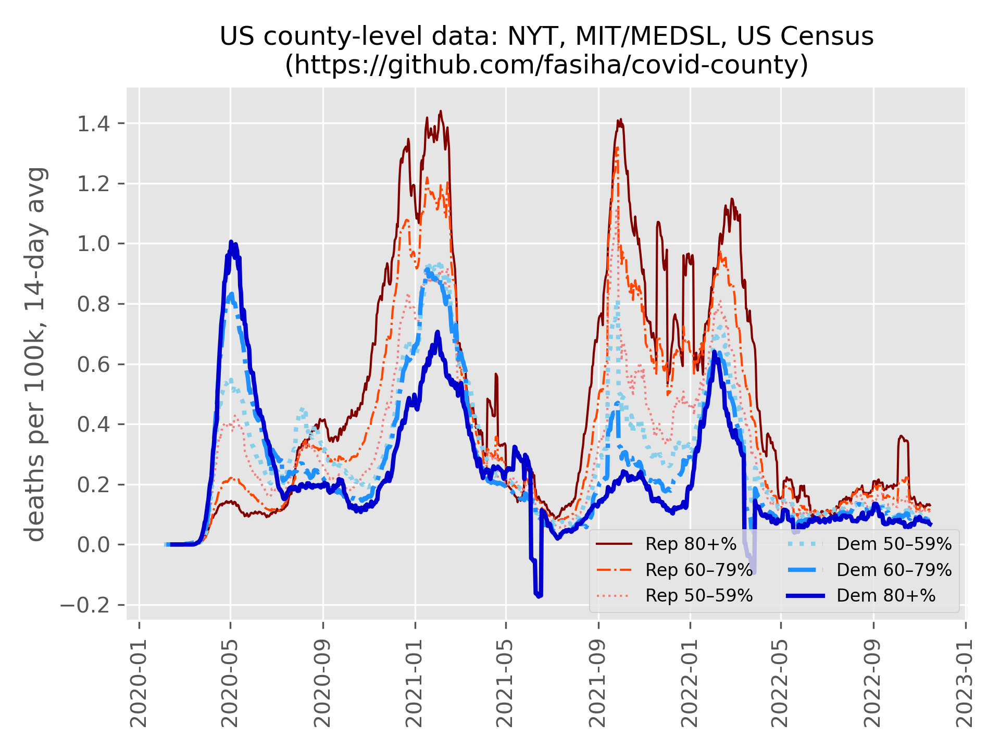

# Covid County
## Executive summary



## More results
| party bin  | total Covid-19 deaths |
| :--------- | --------------------: |
| Rep 80+%   |    52584 |
| Rep 60–79% |   287545 |
| Rep 50–59% |   167310 |
| Dem 50–59% |   257946 |
| Dem 60–79% |   269702 |
| Dem 80+%   |    23503 |
| unknown    |     7803 |

Simply by party:
- Dem: 551151
- Rep: 507439


## Setup
Install [miniconda](https://docs.conda.io/en/latest/miniconda.html), then in the command line, run
```console
conda create -n covid-county
conda activate covid-county
conda install pandas ipython matplotlib tabulate
```
(Let me know if you want pure-Python no-Conda instructions via `venv`.)

## 2020 US presidential election
I've already downloaded `countypres_2000-2020.csv` from https://dataverse.harvard.edu/dataset.xhtml?persistentId=doi:10.7910/DVN/VOQCHQ but you can download it again to ensure I haven't committed bad data.

2020 data is missing counts for District of Columbia (FIPS 11001)? Party split taken from 2016 election.

## Census
From https://www.census.gov/programs-surveys/popest/technical-documentation/research/evaluation-estimates/2020-evaluation-estimates/2010s-counties-total.html I downloaded `co-est2020.csv` from the "Annual Resident Population Estimates for States and Counties: April 1, 2010 to July 1, 2019; April 1, 2020; and July 1, 2020 (CO-EST2020)" link. It's committed in this repo but you can download it yourself too.

## Covid
Install [Git](https://git-scm.com) and run this in this directory: `git clone --depth 1 https://github.com/nytimes/covid-19-data.git` (it might take a while)

Note five boroughs of NYC are combined into a single "county". This is taken into account by merging the 2020 Presidential votes from all five boroughs into a single county (since we can't split the Covid deaths into individual boroughs, this is the best we can do). Fix follows the recommendation per [upstream issue 105](https://github.com/nytimes/covid-19-data/issues/105).

## Run
```
python main.py
```
(Takes ~45 seconds on my 2015-vintage laptop.)
